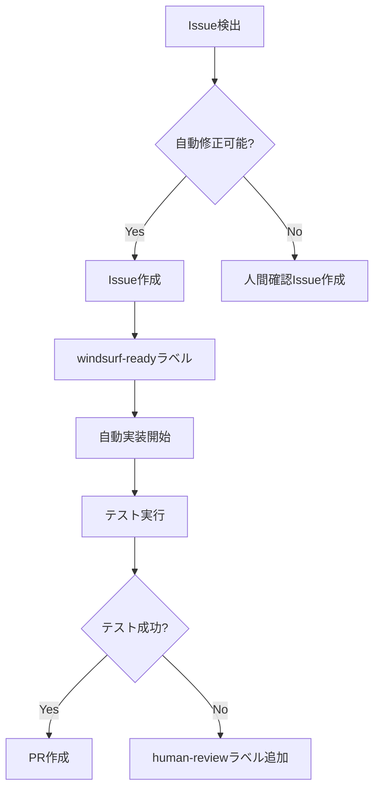

# 🤖 Windsurf自動Issue作成ガイド

## Windsurfが自動的にIssueを作成する条件

### 1. コード品質Issue（自動作成・自動実装）

```yaml
trigger: 定期スキャン（毎日9:00）
action: 
  - 問題検出
  - Issue作成  
  - 自動実装
  - PR作成
```

**検出パターン**:
- UIコンポーネントにレスポンシブ対応なし
- アクセシビリティ属性不足
- TypeScript any型使用
- console.log残存
- エラーハンドリング不足

**Issue作成例**:
```markdown
title: [Auto-Fix] auction-list.tsx レスポンシブ対応追加
labels: ui-improvement, windsurf-ready, auto-implement
assignees: windsurf-bot
body: |
  ## 自動検出された問題
  ファイル: src/components/auction/auction-list.tsx
  問題: モバイル対応クラスが不足
  
  ## 自動修正内容
  - sm: md: lg: クラス追加
  - グリッドレイアウト最適化
  - タッチ操作対応
  
  ## 実行コマンド
  windsurf execute --task responsive-fix --file src/components/auction/auction-list.tsx
```

### 2. パフォーマンスIssue（自動作成・確認必要）

```yaml
trigger: ビルド時チェック
action:
  - 問題検出
  - Issue作成
  - 人間レビュー待ち
```

**検出パターン**:
- バンドルサイズ > 1.5MB
- 未使用コード検出
- 重複インポート
- 大きな画像ファイル

### 3. 新機能提案Issue（週次作成）

```yaml
trigger: 週次分析（月曜10:00）
action:
  - 使用状況分析
  - 改善点抽出
  - Issue作成
```

**分析基準**:
- よく使われるUIパターン
- エラー頻度
- ユーザーフロー改善点

---

## GitHub Issue自動作成スクリプト

```typescript
// scripts/auto-issue-creator.ts
import { Octokit } from '@octokit/rest';
import { scanForIssues } from './issue-scanner';

const octokit = new Octokit({
  auth: process.env.GITHUB_TOKEN,
});

async function createAutoIssues() {
  const issues = await scanForIssues();
  
  for (const issue of issues) {
    if (issue.autoFixable && issue.severity !== 'low') {
      await octokit.issues.create({
        owner: 'kentanonaka',
        repo: 'time-bid',
        title: `[Auto-Fix] ${issue.title}`,
        body: issue.body,
        labels: ['windsurf-ready', 'auto-implement', issue.type],
      });
      
      console.log(`Created issue: ${issue.title}`);
    }
  }
}

// 実行
createAutoIssues();
```

---

## Windsurf Issue処理フロー



---

## 実行コマンド

```bash
# Issue自動作成を今すぐ実行
npm run windsurf:scan-issues

# 定期実行設定（cron）
npm run windsurf:schedule

# 特定ファイルのみスキャン
npm run windsurf:scan -- --file src/components/auction/
```
